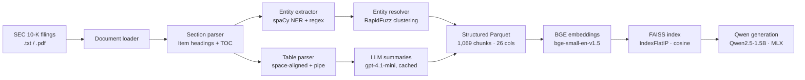

# SEC 10-K RAG Pipeline

A modular document-intelligence and retrieval pipeline for SEC 10-K filings, covering ingestion, structural parsing, entity resolution, table extraction, embedding-based retrieval, and local LLM generation.

The pipeline processes 50 publicly available 10-K filings into a structured Parquet dataset, builds a FAISS semantic index over BGE embeddings, and serves an interactive QA REPL backed by a locally-run quantized Qwen model via Apple MLX.

---

## Architecture



---

## Pipeline Stages

| Stage | Module | Description |
|---|---|---|
| 1 · Document loading | `src/document_reader.py` | Reads `.txt` and optional `.pdf` files; assigns stable `document_id` |
| 2 · Section parsing | `src/section_parser.py` | Detects Item headings via TOC extraction (LLM-assisted) + regex fallback; maps to 12 categories |
| 3 · Entity extraction | `src/entity_extractor.py` | spaCy NER for `company` / `person`; regex for `monetary_value` |
| 4 · Entity resolution | `src/entity_resolver.py` | RapidFuzz fuzzy clustering groups variant mentions to a canonical name per document |
| 5 · Table parsing | `src/table_parser.py` | Detects space-aligned and pipe-separated tables; infers column headers; generates LLM summaries (cached) |
| 6 · Parquet output | `src/pipeline.py` | Writes `outputs/final/chunks.parquet` — one row per chunk, 26 columns |
| 7 · Embedding + index | `scripts/build_rag_index.py` | Encodes `retrieval_text` with BGE; builds FAISS `IndexFlatIP` |

---

## Output Schema

Each row in `outputs/final/chunks.parquet` represents one document chunk:

| Column | Description |
|---|---|
| `document_id`, `record_id` | Stable identifiers |
| `company_name`, `cik`, `filing_year` | Filing metadata |
| `section_category`, `heading` | One of 12 SEC Item categories |
| `chunk_text` | Raw extracted text |
| `retrieval_text` | Pre-formatted text for embedding (heading + text) |
| `entities_json` | Extracted company, person, and monetary entities |
| `resolved_entities_json` | Canonical entity groups with variants and resolution method |
| `tables_json` | Parsed tables with columns, rows, and natural-language summary |
| `has_tables`, `table_count` | Derived boolean and count columns |

---

## Quick Start

```bash
# 1. Create environment (Python 3.12)
python -m venv .venv && source .venv/bin/activate

# 2. Install dependencies
pip install -r requirements.txt
python -m spacy download en_core_web_sm

# 3. Set your OpenAI key (used for TOC extraction + table summaries, cached after first run)
echo "OPENAI_API_KEY=sk-..." > .env

# 4. Unzip the documents
cd data && unzip Documents.zip && cd ..

# 5. Run the full pipeline
python scripts/run_pipeline.py --standardize --use-llm-table-summaries

# 6. Validate results
python scripts/validate_outputs.py --input outputs/final/chunks.jsonl

# 7. Run the RAG demo
python app.py
```

Faster options:

```bash
# Skip table parsing (much faster, no API calls)
python scripts/run_pipeline.py --stop-after 4

# Smoke test with 5 documents
python scripts/run_pipeline.py --limit 5

# Rebuild FAISS index after re-running
python scripts/build_rag_index.py
```

---

## Code Structure

```
src/
  constants.py          # paths, thresholds, category taxonomy
  document_reader.py    # .txt / PDF loader
  section_parser.py     # heading detection, TOC extraction, chunking
  entity_extractor.py   # spaCy NER + monetary regex
  entity_resolver.py    # RapidFuzz resolution
  table_parser.py       # table detection, column inference, LLM summaries
  pipeline.py           # orchestration (Stages 1-6)
  retrieval.py          # FAISS search helper
  generation.py         # MLX local LLM generation
  rag_prompt.py         # system prompt and context formatter

scripts/
  run_pipeline.py       # CLI entry point
  build_rag_index.py    # embed chunks → FAISS index
  standardize_output.py # JSONL → Parquet
  validate_outputs.py   # validation report + PNG plot
  inspect_outputs.py    # HTML chunk inspector

tests/                  # 47 unit tests (pytest)
app.py                  # interactive RAG REPL
```

---

## Section Categories

Mapped deterministically from SEC 10-K Item numbers:

`business_overview` · `risk_factors` · `financial_results` · `management_discussion` · `legal_proceedings` · `governance` · `notes_to_financial_statements` · `properties` · `disclosures` · `market_information` · `exhibits` · `other`

---

## RAG Demo

```
python app.py
> What were Exelon's total revenues in 2018?
> What risks did Dominion Energy disclose related to climate change?
```

- **Embeddings:** `BAAI/bge-small-en-v1.5` (384-dim, sentence-transformers)
- **Index:** FAISS `IndexFlatIP` with L2-normalised vectors (cosine similarity)
- **Generation:** `Qwen2.5-1.5B-Instruct-4bit` via Apple MLX — no PyTorch, runs on Apple Silicon

Example outputs are in [`outputs/evaluation/llm_rag_examples/`](outputs/evaluation/llm_rag_examples/).

**Known limitation:** the retriever returns k=5 results regardless of relevance score. A similarity threshold would reduce hallucination on out-of-corpus queries.

---

## Testing

47 unit tests covering entity extraction, entity resolution, section categorization, table parsing, and LLM cache correctness. All tests run without network access or GPU.

```bash
pip install -r requirements-dev.txt
pytest tests/ -v
```

Tests mock all OpenAI calls via `monkeypatch` and do not require spaCy, torch, or any heavy dependency.

---

## LLM Usage

LLM calls (`gpt-4.1-mini`) are used in two places only, both content-addressed and cached:

| Use | Purpose |
|---|---|
| TOC extraction | Parse table-of-contents to locate section boundaries (only when regex fails) |
| Table summaries | 1–3 sentence natural-language description of each parsed table |

Total cost across all development runs: ~$0.95. Re-running from the committed cache is free.
