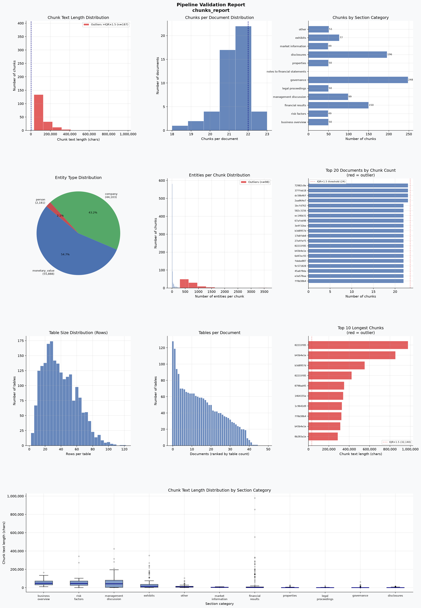

# Pipeline Validation Report

**Source:** `/Users/boncim/Library/CloudStorage/OneDrive-ETHZurich/Desktop/directory/applications/industry/teleskope/mle-take-home-mbonci/outputs/evaluation/chunks.jsonl`  
**Generated:** 2026-07-13 09:43 UTC  
**Documents:** 50 · **Chunks:** 1069 · **Issues flagged:** 221

---
## Task 1 · Section Extraction & Categorization

### Chunk counts

| Metric | Value |
|---|---|
| Documents | 50 |
| Total chunks | 1,069 |
| Chunks/doc — min | 18 |
| Chunks/doc — mean | 21.4 |
| Chunks/doc — median | 22 |
| Chunks/doc — p95 | 23 |
| Chunks/doc — max | 23 |

### Category distribution

| Category | Chunks | Share |
|---|---:|---:|
| `business_overview` | 50 | 4.7% |
| `risk_factors` | 49 | 4.6% |
| `financial_results` | 150 | 14.0% |
| `management_discussion` | 99 | 9.3% |
| `legal_proceedings` | 50 | 4.7% |
| `governance` | 248 | 23.2% |
| `notes_to_financial_statements` | 0 | 0.0% |
| `properties` | 50 | 4.7% |
| `disclosures` | 196 | 18.3% |
| `market_information` | 49 | 4.6% |
| `exhibits` | 77 | 7.2% |
| `other` | 51 | 4.8% |

### Chunk text length — overall

| Stat | Chars |
|---|---:|
| Min | 0 |
| Mean | 23,428 |
| Median | 1,906 |
| p95 | 121,438 |
| Max | 978,271 |

### Chunk text length by section category

| Category | n | Min | Median | Mean | p95 | Max |
|---|---:|---:|---:|---:|---:|---:|
| `business_overview` | 50 | 10,067 | 47,137 | 56,096 | 112,408 | 166,430 |
| `risk_factors` | 49 | 21 | 46,410 | 58,273 | 102,630 | 342,595 |
| `management_discussion` | 99 | 0 | 42,950 | 57,897 | 195,965 | 424,436 |
| `exhibits` | 77 | 414 | 14,648 | 50,619 | 235,727 | 352,077 |
| `other` | 51 | 270 | 8,420 | 16,892 | 70,684 | 104,361 |
| `market_information` | 49 | 64 | 4,143 | 4,492 | 9,869 | 10,064 |
| `financial_results` | 150 | 0 | 1,571 | 51,204 | 270,587 | 978,271 |
| `properties` | 50 | 0 | 1,309 | 3,277 | 16,966 | 26,474 |
| `legal_proceedings` | 50 | 0 | 767 | 1,752 | 5,197 | 23,759 |
| `governance` | 248 | 0 | 336 | 1,662 | 6,154 | 63,357 |
| `disclosures` | 196 | 0 | 40 | 1,680 | 8,579 | 15,700 |

### Outlier chunks — very long text

| Document | Chars |
|---|---:|
| `EXELON CORP__CIK0001109357__000162828018001324_exc  [02233f85b313]` | 978,271 |
| `EXELON CORP__CIK0001109357__000162828019001107_exc  [b43b4e1e08c0]` | 854,785 |
| `DOMINION ENERGY_ INC__CIK0000715957__0001193125190  [b3d8957d3ba0]` | 553,698 |
| `EXELON CORP__CIK0001109357__000162828018001324_exc  [02233f85b313]` | 424,436 |
| `MOSAIC CO__CIK0001285785__000161803415000005_mos-2  [0790ad45718c]` | 352,077 |
| `KKR _ Co. Inc.__CIK0001404912__000140491217000005_  [1464155eda3f]` | 342,595 |
| `PUBLIC SERVICE ENTERPRISE GROUP INC__CIK0000788784  [1c9642d92755]` | 329,887 |
| `MOLSON COORS BEVERAGE CO__CIK0000024545__000002454  [ff0d30b46863]` | 325,158 |
| `EXELON CORP__CIK0001109357__000162828019001107_exc  [b43b4e1e08c0]` | 314,441 |
| `Warner Bros. Discovery_ Inc.__CIK0001437107__00014  [0b203a1e93f4]` | 289,296 |

---
## Task 2 · Entity Extraction

### Totals

| Entity type | Count | Share |
|---|---:|---:|
| `monetary_value` | 55,888 | 54.7% |
| `company` | 44,103 | 43.2% |
| `person` | 2,181 | 2.1% |

### Entities per chunk

| Stat | Value |
|---|---:|
| Mean | 95.6 |
| Median | 5.0 |
| p95 | 590.0 |
| Max | 3609.0 |

### Top 10 `company` entities

| Entity | Mentions |
|---|---:|
| KKR | 586 |
| Dominion Energy | 397 |
| BGE | 336 |
| Altria Group | 331 |
| Zebra | 289 |
| FDA | 276 |
| DPL | 274 |
| TransDigm Group Incorporated’s | 237 |
| PECO | 229 |
| Quanta | 226 |

### Top 10 `person` entities

| Entity | Mentions |
|---|---:|
| David M. Velazquez | 29 |
| Christopher M. Crane | 18 |
| CHRISTOPHER M. CRANE | 16 |
| Jeffrey A. Stoops | 14 |
| Thomas F. Farrell | 13 |
| Martin J. Lyons | 12 |
| Abbas Salih | 12 |
| Fred Schultz | 11 |
| Brendan T. Cavanagh | 10 |
| Anne R. Pramaggiore | 9 |

### Top 10 `monetary_value` entities

| Entity | Mentions |
|---|---:|
| $ 1 | 262 |
| $ 2 | 198 |
| $1 million | 168 |
| $ 3 | 168 |
| $ 0 | 139 |
| $5 million | 131 |
| $ 7 | 130 |
| $ 6 | 126 |
| $ 5 | 121 |
| $2 million | 115 |

### Outlier chunks — high entity count (> 290)

| Document | Chunk | Entities |
|---|---|---:|
| `EXELON CORP__CIK0001109357__000162828018001324_exc  [02233f85b313]` | `ITEM 8. FINANCIAL STATEMENTS AND SUPPLEM` | 3,609 |
| `EXELON CORP__CIK0001109357__000162828019001107_exc  [b43b4e1e08c0]` | `ITEM 8. FINANCIAL STATEMENTS AND SUPPLEM` | 3,580 |
| `DOMINION ENERGY_ INC__CIK0000715957__0001193125190  [b3d8957d3ba0]` | `Item 8. Financial Statements and Supplem` | 2,356 |
| `PUBLIC SERVICE ENTERPRISE GROUP INC__CIK0000788784  [1c9642d92755]` | `ITEM 8.    FINANCIAL STATEMENTS AND SUPP` | 1,781 |
| `TransDigm Group INC__CIK0001260221__00012602211800  [8e46b7b3bb9d]` | `PART IV

ITEM 15.    EXHIBITS AND FINANC` | 1,538 |
| `EXELON CORP__CIK0001109357__000162828018001324_exc  [02233f85b313]` | `Item 7. MANAGEMENT’S DISCUSSION AND ANAL` | 1,458 |
| `MOLSON COORS BEVERAGE CO__CIK0000024545__000002454  [ff0d30b46863]` | `ITEM 8.    FINANCIAL STATEMENTS AND SUPP` | 1,370 |
| `MOSAIC CO__CIK0001285785__000161803415000005_mos-2  [0790ad45718c]` | `PART IV. Item 15. Exhibits and Financial` | 1,334 |
| `CHARTER COMMUNICATIONS_ INC. _MO___CIK0001091667__  [c84854b6405c]` | `PART IV

Item 15. Exhibits and Financial` | 1,279 |
| `ALTRIA GROUP_ INC.__CIK0000764180__000076418014000  [c17d5d93f675]` | `Item 8. Financial Statements and Supplem` | 1,238 |

---
## Task 3 · Entity Resolution

| Metric | Value | Definition |
|---|---:|---|
| Raw entities | 102,172 | All extracted mentions (company + person + monetary_value) |
| Resolvable (company + person) | 46,284 | Company + person mentions only — candidates for grouping |
| Resolved entries | 18,997 | Resolvable mentions assigned a canonical name |
| Coverage | 41.0% | Resolved / resolvable |
| Unique canonical names | 11,324 | Distinct representative names after grouping variants |

Singleton canonical names (appear in 1 chunk only): **8228** (72.7%)

### Top 10 canonical entities

| Canonical name | Chunks |
|---|---:|
| the Securities and Exchange Commission | 119 |
| the New York Stock Exchange | 77 |
| the Financial Accounting Standards Board | 35 |
| the Consolidated Balance Sheets | 29 |
| the European Union | 29 |
| the Private Securities Litigation Reform Act | 26 |
| Contracts with Customers | 25 |
| the Internal Revenue Service | 24 |
| Bank of America | 24 |
| Atlantic City Electric Company | 24 |

### Resolution method breakdown

| Method | Count | % | Definition |
|---|---:|---:|---|
| canonical | 17,312 | 91.1% | mention is the chosen representative — no merge needed |
| normalized_exact | 1,070 | 5.6% | matched after stripping legal suffixes and lowercasing |
| acronym | 321 | 1.7% | short all-caps form matched to long-form word initials |
| strict_fuzzy | 246 | 1.3% | fuzzy score ≥ threshold on both ratio and token_sort |
| cluster_link | 35 | 0.2% | transitively connected — no direct merge rule fired |
| person_name | 10 | 0.1% | shared first + last name (person-specific rule) |
| person_initials | 3 | 0.0% | matching initials + shared last name |

### Resolution score distribution *(excludes canonical/singleton)*

min **0** · p25 **100** · p50 **100** · p75 **100** · max **100**

- Score = 100 → exact / acronym match
- Score 90–99 → fuzzy match above threshold
- Score < 50 → cluster_link with weak direct evidence

### One example per resolution method

| Method | Matched text | Canonical name | Score |
|---|---|---|---:|
| canonical | 10-K  AFL | 10-K  AFL | 100 |
| normalized_exact | Aflac | Aflac Incorporated | 100 |
| acronym | NAIC | the National Association of Insurance Commissioner | 100 |
| strict_fuzzy | Aflac Japan Investments | the Aflac Japan Investment | 97 |
| cluster_link | AER | New Ameren Energy Resources Company | 0 |
| person_initials | Bryan C | Bryan P. | 95 |
| person_name | Aaron P. Jagdfeld | Aaron Jagdfeld | 95 |

---
## Task 4 · Table Detection & Parsing

| Metric | Value |
|---|---|
| Total tables | 2,061 |
| Chunks with ≥1 table | 182 (17.0%) |
| Documents with ≥1 table | 45/50 |
| Column detection rate | 2,061/2,061 (100.0%) |
| Rows structured as dicts | 2,061/2,061 (100.0%) |
| Tables with summary | 2,061 (100.0%) |
| LLM summaries | 2,061 (100.0%) |
| Rows/table — mean / p50 / max | 38.5 / 35 / 122 |
| Cols/table — mean / p50 / max | 2.7 / 2 / 14 |

### Table type breakdown

| Type | Count | % |
|---|---:|---:|
| financial | 2,061 | 100.0% |

### Tables by section category

| Category | Tables | Sections w/ table | Avg rows | Col detect |
|---|---:|---:|---:|---:|
| financial_results | 991 | 60/150 (40.0%) | 41.2 | 100% |
| exhibits | 554 | 28/77 (36.4%) | 42.0 | 100% |
| management_discussion | 440 | 50/99 (50.5%) | 29.7 | 100% |
| business_overview | 42 | 18/50 (36.0%) | 31.4 | 100% |
| market_information | 18 | 18/49 (36.7%) | 14.4 | 100% |
| governance | 8 | 4/248 (1.6%) | 44.2 | 100% |
| risk_factors | 7 | 3/49 (6.1%) | 12.7 | 100% |
| properties | 1 | 1/50 (2.0%) | 4.0 | 100% |
| other | 0 | 0/51 (0.0%) | 0.0 | 0% |
| disclosures | 0 | 0/196 (0.0%) | 0.0 | 0% |
| legal_proceedings | 0 | 0/50 (0.0%) | 0.0 | 0% |

### LLM cost summary

**Last run**

| Metric | Value |
|---|---:|
| Fresh API calls | 5,706 |
| Cache hits | 3,880 (40.5%) |

**Cumulative (all runs)**

| Metric | Value |
|---|---:|
| Unique API calls | 2,677 |
| — named-column summaries | 1,121 |
| — generic-column inference | 1,556 |
| Prompt tokens | 1,332,090 |
| Completion tokens | 262,152 |
| Total tokens | 1,594,242 |
| Estimated cost | $0.9523 |
